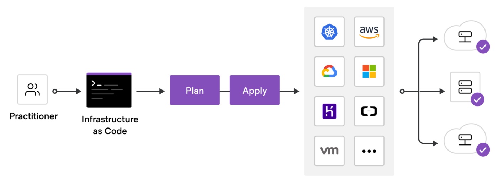

# infra-database </img>
Infraestrutura de banco de dados com Terraform para o Sistema de controle para pedidos de autoatendimento em lanchonete integrado à API de pagamento do Mercado Pago.

    Infra as Code com Terraform</img>

Todo o processo de deploy automatizado é feito através do Github Actions com boas práticas de CI/CD. A Cloud escolhida para este exemplo foi a AWS.

     Diagrama da Estrutura do Banco de Dados</img>

